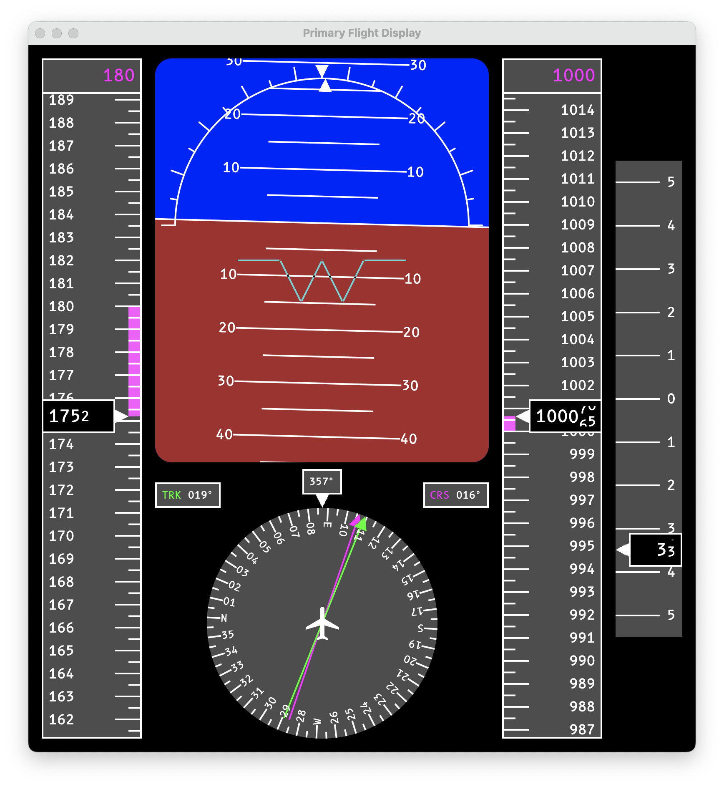

# Primary Flight Display Library for Compose for Desktop

<p align="center">
  
</p>

This library provides a customizable Primary Flight Display (PFD) built using Compose for Desktop. It features the
following instruments:

* Altitude Indicator
* Bank Indicator
* Compass
* Artificial Horizon
* Speed Indicator
* Vertical Speed Indicator

## Usage

```kotlin
@Composable
fun YourFlightScreen() {
    PrimaryFlightDisplay(
        roll = // roll angle in degrees,
        pitch = // roll angle in degrees
        heading = // heading in degrees
        track = // track in degrees
        course = // course over ground in degree
        altitude = // altitude (unitless)
        targetAltitude = // autopilot target altitude (unitless)
        speed = // speed (unitless)
        targetSpeed = // autopilot target speed (unitless)
        verticalSpeed = // vertical speed (unitless)
    )
}
```

## Customization and Theming

### Custom Indicators
You can customize the appearance and behavior of the PFD by passing in custom composables for each indicator:

```kotlin
PrimaryFlightDisplay(
    // ...other parameters,
    attitudeIndicator = { roll, pitch -> /* your custom composable */ },
    compass = { heading, track, course -> /* your custom composable */ },
    altitudeIndicator = { altitude, targetAltitude -> /* your custom composable */ },
    speedIndicator = { speed, targetSpeed -> /* your custom composable */ },
    verticalSpeedIndicator = { verticalSpeed -> /* your custom composable */ }
)
```

### Theming
The PFD uses a custom theme that can be adjusted to fit your needs. The theme is divided into three main parts:

#### Colors
You can define a custom color scheme using the `PfdColors` data class:

```kotlin
data class PfdColors(
    val groundColor: Color,
    val skyColor: Color,
    val indicatorColor: Color,
    val bgColor: Color,
    val courseColor: Color,
    val trackColor: Color
)
```

```kotlin
PrimaryFlightDisplay(
    // ...other parameters,
    colors = defaultPfdColorScheme(groundColor = Color(0xA52A2A))
)
```

#### Dimensions
Customize the dimensions of various elements using the `PfdDimensions` data class:

```kotlin
data class PfdDimensions(
    val indicatorStrokeWidth: Dp,
    val indicatorSizeLong: Dp,
    val indicatorSizeShort: Dp,
    val spacingRegular: Dp,
    val spacingLarge: Dp
)
```

```kotlin
PrimaryFlightDisplay(
    // ...other parameters,
    dimensions = defaultPfdDimensions(indicatorStrokeWidth = 1.dp)
)
```

#### Typography
Text styles can be customized using the `PfdTypography` data class:

```kotlin
data class PfdTypography(
    val small: TextStyle,
    val regular: TextStyle,
    val large: TextStyle
)
```

```kotlin
PrimaryFlightDisplay(
    // ...other parameters,
    typography = defaultPfdTypography(
        regular = TextStyle(
            color = Color.White,
            fontFamily = FontFamily(Font(resource = "fonts/b612_mono_regular.ttf")),
            fontSize = TextUnit(12f, TextUnitType.Sp)
        )
    )
)
```